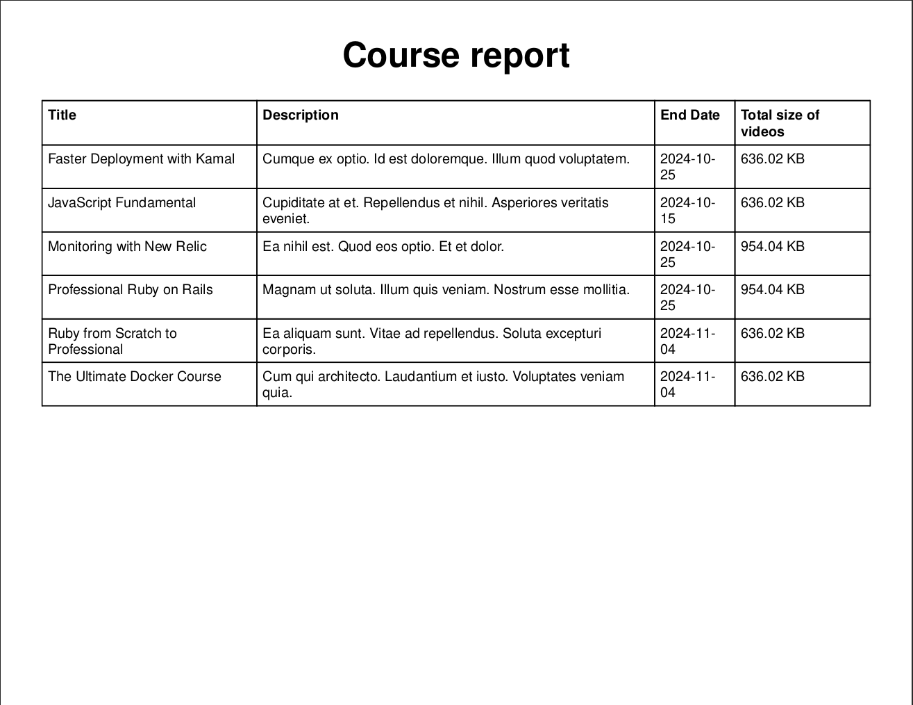

# About

A small system developed to meet the challenge or test of the company Twygo. With it, you can create your courses and manage them in the best possible way, as well as generate reports.

When running this project, you can access the administrative part after your authentication.

# Images




# Dependencies

- Ruby 3.3.5
- Rails 7.2.1.1
- RSpec 7.0
- Postgresql

# How to run

NOTE: check the config/database.yml file with your database information

```
git clone https://github.com/Hendrew/course-on-rails.git

cd course_on_rails

bundle

bundle exec rspec

foreman start -f Procfile.dev
```
